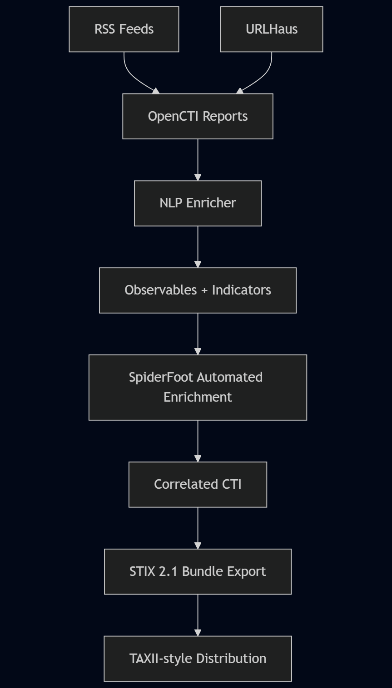

# CTI Platform (EduQual Level 6)

## Automated Cyber Threat Intelligence: Collection → Analysis → Dissemination

**Project Title:** Comprehensive Cyber Threat Intelligence Platform with Automated Collection, Analysis, and Dissemination

**Student:** Muzammal

**Qualification:** Diploma in Artificial Intelligence Operations (EduQual Level 6)


**Core Stack:** OpenCTI · OSINT (RSS + SpiderFoot) · NLP IOC Extraction · STIX 2.1 · TAXII-style Sharing

---

## 1. Project Overview (What This Platform Does)

This project implements a **fully automated Cyber Threat Intelligence (CTI) lifecycle** aligned with industry standards (MITRE ATT&CK, STIX/TAXII, OpenCTI).

The platform continuously:

1. **Collects** open-source threat intelligence (OSINT)
2. **Analyzes & enriches** the data using NLP and structured IOC extraction
3. **Stores & correlates** intelligence inside OpenCTI
4. **Disseminates** intelligence using STIX 2.1 bundles (TAXII-style sharing)

This mirrors how **real SOCs, MSSPs, and national CERTs** operate CTI pipelines.

---

## 2. End-to-End Automation Flow (High Level)

```
RSS Feeds / SpiderFoot
        ↓
OpenCTI Reports (Auto)
        ↓
NLP Enricher (Auto)
        ↓
Observables + Indicators
        ↓
STIX 2.1 Bundle Export
        ↓
TAXII-style Distribution
```

Everything runs **headless and automatically** once Docker Compose is started.

---

## 3. Architecture (Layered Design)




### Layer 1 – OSINT Collection

**RSS Ingestor (Custom – Automated)**

* Reads 23 curated CTI RSS feeds
* Converts articles into **OpenCTI Reports**
* Deduplicates content using SQLite state tracking

**SpiderFoot (OSINT Recon – Semi / Fully Automated)**

* Performs deep OSINT reconnaissance
* Can enrich domains, IPs, URLs, threat actors, infrastructure
* Can be triggered **manually OR automatically** (explained below)

---

### Layer 2 – CTI Knowledge Base

**OpenCTI Platform**

* Central CTI database and analyst dashboard
* GraphQL API for automation
* Stores reports, observables, indicators, relationships

**OpenCTI Worker**

* Background jobs (indexing, connectors, imports)

---

### Layer 3 – Core Dependencies

| Service       | Purpose                               |
| ------------- | ------------------------------------- |
| Redis         | Cache / OpenCTI internal state        |
| Elasticsearch | Search + indexing engine              |
| RabbitMQ      | Async task queue                      |
| MinIO         | Object storage (attachments, exports) |

---

### Layer 4 – Analysis & Enrichment (AI / NLP)

**NLP Enricher (Custom – Fully Automated)**

* Reads recent OpenCTI reports
* Extracts:

  * Domains
  * URLs
  * IPv4 / IPv6
  * Hashes (MD5 / SHA1 / SHA256)
  * CVEs
* Assigns confidence score
* Creates:

  * STIX Observables
  * STIX Indicators (`createIndicator=true`)
* Labels all objects as `auto-extracted`

---

### Layer 5 – Dissemination & Sharing

**TAXII Exporter (Custom – Automated)**

* Pulls intelligence from OpenCTI
* Exports **STIX 2.1 JSON bundle**

**TAXII Demo Server**

* Serves bundle at:

  ```
  http://<server-ip>:9000/bundle.json
  ```

This simulates **CTI sharing between organizations**.

---

## 4. Folder Structure

```
cti-platform/
├─ docker-compose.yml
├─ .env
├─ data/
│  ├─ opencti-export/      # STIX bundle output
│  ├─ rss/                # RSS ingestor state DB
│  └─ nlp/                # NLP enricher state DB
└─ services/
   ├─ rss-ingestor/
   ├─ nlp-enricher/
   ├─ taxii-exporter/
   └─ spiderfoot-web/
```

---

## 5. Requirements

* Ubuntu 22.04+ (recommended)
* Docker Engine
* Docker Compose plugin

### Docker Install (Ubuntu)

```bash
sudo apt update
sudo apt install -y docker.io docker-compose-plugin
sudo usermod -aG docker $USER
newgrp docker
```

Verify:

```bash
docker --version
docker compose version
```

---

## 6. Environment Configuration (.env)

Create `.env` in project root:

```env
OPENCTI_ADMIN_EMAIL=admin@demo.local
OPENCTI_ADMIN_PASSWORD=ChangeMe_Admin123!
OPENCTI_ADMIN_TOKEN=CHANGE_ME_TOKEN

RABBITMQ_USER=opencti
RABBITMQ_PASS=opencti_password

MINIO_USER=opencti
MINIO_PASS=opencti_password

APP_BASE_URL=http://localhost:8080
```

Load env variables when using CLI tools:

```bash
set -a; source ./.env; set +a
```

---

## 7. Docker Services Summary (Nothing Hidden)

| Service            | Port         | Purpose                 |
| ------------------ | ------------ | ----------------------- |
| OpenCTI            | 8080         | CTI Dashboard + GraphQL |
| Elasticsearch      | 9200         | Search backend          |
| RabbitMQ           | 5672 / 15672 | Queue + UI              |
| MinIO              | 9001         | Object storage          |
| SpiderFoot         | 5001         | OSINT UI                |
| SpiderFoot (nginx) | 5002         | Clean URL               |
| TAXII Server       | 9000         | STIX bundle             |

---

## 8. Start the Platform

```bash
docker compose up -d --build
docker compose ps
```

---

## 9. Access URLs

* OpenCTI:
  `http://<server-ip>:8080`
* RabbitMQ UI:
  `http://<server-ip>:15672`
* SpiderFoot UI:
  `http://<server-ip>:5001`
* SpiderFoot (nginx):
  `http://<server-ip>:5002/spiderfoot`
* STIX Bundle:
  `http://<server-ip>:9000/bundle.json`

---

## 10. SpiderFoot – What It Does & How It Fits

### What is SpiderFoot?

SpiderFoot is an **automated OSINT reconnaissance engine** that can:

* Discover infrastructure related to a domain or IP
* Identify:

  * IPs, domains, subdomains
  * Emails, usernames
  * Hosting providers
  * Known malicious indicators
* Correlate data from **100+ OSINT sources**

In this platform, SpiderFoot acts as an **advanced enrichment layer**.

---

### How SpiderFoot Is Used in This Project

**Current Mode (Default):**

* Runs as a service
* Analyst can manually scan:

  * Domains from RSS reports
  * IPs extracted by NLP
* Results viewed via UI

**Why this matters for assessment:**
This demonstrates **human-in-the-loop CTI analysis**, which is realistic in SOC environments.

---

## 11. SpiderFoot Automation (Planned / Supported)

This platform is designed so SpiderFoot can be **fully automated**:

### Automated Flow (Design)

```
RSS Report
   ↓
NLP extracts domain / IP
   ↓
SpiderFoot auto-scan
   ↓
Results pushed into OpenCTI
```

### How to Enable Full Automation (Concept)

1. Use SpiderFoot CLI:

   ```bash
   spiderfoot -s example.com -o json
   ```
2. Parse results (IP, domain, emails)
3. Push as:

   * Observables
   * Relationships
   * External references
4. Schedule scans via cron or Celery

**This turns SpiderFoot into an autonomous OSINT enricher**, similar to commercial CTI platforms.

---

## 12. Automation Proof (Working Evidence)

### Collection – RSS

```bash
docker compose logs -f rss-ingestor
```

Expected:

* `loaded 23 feeds`
* `created report`

---

### Analysis – NLP Enrichment

```bash
docker compose logs -f nlp-enricher
```

Expected:

* Observables created
* Confidence score assigned

---

### Dissemination – STIX Bundle

```bash
curl http://127.0.0.1:9000/bundle.json | head -n 40
```

Expected:

* `indicator` and `observable` objects present

---

## 13. Verification Commands (Exam Evidence)

All provided GraphQL and curl checks confirm:

✅ Automated ingestion
✅ Automated enrichment
✅ Automated dissemination
✅ Real CTI objects (STIX compliant)

---

## 14. Stop / Reset

Stop services:

```bash
docker compose down
```

Full reset:

```bash
docker compose down -v
rm -rf data/rss data/nlp data/opencti-export
```

---

HAPPY HUNTING
